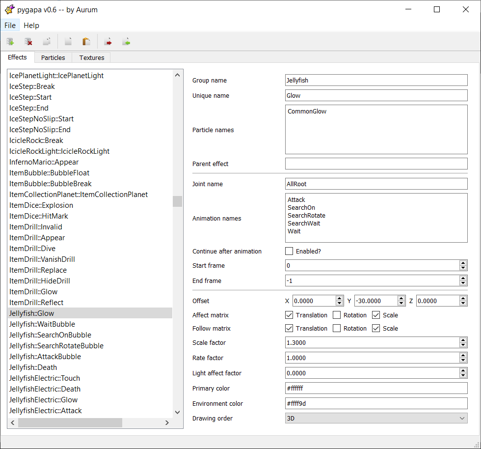

# pygapa

This is an unofficial fork of [pygapa](https://github.com/SunakazeKun/pygapa) that aims to add JPAC2-10 editing.
## IT IS STILL IN DEVELOPMENT SO THERE MAY BE BUGS

# Requirements
Before you can use this tool, make sure you have installed and prepared the following programs and software:
- [Python 3.9.0](https://www.python.org/) or newer
- [pip](https://pypi.org/project/pip/), the Python package installer
- [PyQT5](https://pypi.org/project/PyQt5/), a set Python bindings for Qt
- [wszst](https://szs.wiimm.de/wszst/) or [yaz0enc](http://www.amnoid.de/gc/yaz0enc.zip), tools to compress SZS

# To-Do
Here's what this fork plans on accomplishing (or has accomplished) at the moment.
| Function | Priority | Description |
| - | - | - |
| Visual particle editing | **High** | As of now, adding completely new particles or editing their aspects is not implemented yet. The creators of *noclip.website* already documented the entirety of the particles engine, which will be a great help when parsing the particle blocks. |
| Batch mode particle editing | **High** | This is done, and there are no plans on adding new features here at the moment. |


# Batch mode
If you want to dump and convert particle data, you need to extract the files from *ParticleData/Effect.arc* first. You can use *szstools* (or WiiExplorer) to deal with RARC archives. The extracted files are *Particles.jpc*, *ParticleNames.bcsv* and *AutoEffectList.bcsv*. Copy that folder's path and open your command prompt, shell or any command-line console. In the shell, browse to the *pygapa* folder and type in the following command:
``python pygapa.py dump <path to JPC and BCSV files> <path to dump files to>``
Then, hit enter and *pygapa* will dump the data for you. This may take a couple of seconds. Any non-existent folders will be created by the tool if they don't exist already.

Converting the JSON and BTI files back into SMG's format is very simple as well. Again, in the shell, just enter the following command:
``python pygapa.py pack <path to JSON and BTI files> <path to JPC and BCSV files>``
You'll then obtain new BCSV and JPC files that can be packed into a proper Effect.arc archive using *szstools* (or WiiExplorer).

After dumping the files, you'll find the following files and folders:
- **Particles.json**: Specifies the particle and texture names that belong to the JPC file.
- **Effects.json**: A simplified version of *AutoEffectList*, the table that specifies every object's effects.
- **Particles**: Contains JSON files for every particle.
- **Textures**: Contains BTI particle textures.

## Particles.json
This file specifies the particles and textures that should be packed into the JPC file. If you are adding new textures or particles, make sure to add them to the respective lists here. You can also delete entries to exclude them from the JPC. *Particles.json* has a very simple structure and looks like this:
```json
{
	"particles": [
		"2PGlowActiveLoop00",
		"AirBubbleGeneratorShoot00",
		"AirBubbleGeneratorShoot01",
		...
		"testFooFiterSpray02"
	],
	"textures": [
		"mr_glow01_i",
		"mr_flash00_i",
		"mr_sand00_ia",
		...
		"DashYoshiBlur"
	]
}
```

## Effects.json
As pointed out above, this file contains the entries from *AutoEffectList.bcsv*. Here, you define all effects for  objects and the particles they use. There are quite a lot of fields here, but for the sake of simplicity, the tool drops any attributes containing default values. The structure looks like this (example from SMG1):
```json
[
    {
        "GroupName": "Kuribo",
        "AnimName": "Run",
        "UniqueName": "DashAttrDefault",
        "EffectName": [
            "SmokeSphere"
        ],
        "JointName": "Center",
        "OffsetY": -35.0,
        "Affect": "T/R",
        "Follow": "T",
        "ScaleValue": 0.3,
        "DrawOrder": "3D"
    },
    ...
]
```
Each entry consists of these attributes. When packing the files again, the default values are used whenever an attribute cannot be found.
| Field | Type | Default | Description |
| - | - | - | - |
| GroupName | string | **Required** | The object's name to which the effect belongs. |
| AnimName | string[] | [] | Animation names during which the effect is emitted. |
| ContinueAnimEnd | bool | false | Declares whether the effect continues after the animation has ended. |
| UniqueName | string | **Required** | A unique identifier for the effect in the group. |
| EffectName | string[]| **Required** | A list of particle effects to be used. |
| ParentName | string | *(empty)* | The unique name of the parent effect to which this effect belongs. |
| JointName | string | *(empty)* | The model's joint to which the effect is attached. |
| OffsetX | float | 0.0 | X offset from the object/joint's position. |
| OffsetY | float | 0.0 | Y offset from the object/joint's position. |
| OffsetZ | float | 0.0 | Z offset from the object/joint's position. |
| StartFrame | int | 0 | The frame on which the effect starts to appear. |
| EndFrame | int | -1 | If set to a positive value, this defines the life span in frames. |
| Affect | list | *(empty)* | Affect matrix flags, list of *T*, *R* and *S* strings. |
| Follow | list | *(empty)* | Followmatrix flags, list of *T*, *R* and *S* strings. |
| ScaleValue | float | 1.0 | Scaling/size factor. |
| RateValue | float | 1.0 | Unknown. |
| PrmColor | string | *(empty)* | Primary color value. (e.g. *#ff0000* is R = 255, G = 0 B = 0) |
| EnvColor | string | *(empty)* | Environment color value. (e.g. *#00ff00* is R = 0, G = 255, B = 0) |
| LightAffectValue | float | 0.0 | Unknown. |
| DrawOrder | string | *(empty)* | Rendering order/priority, see below for allowed values. |

#### DrawOrder types
The DrawOrder field declares the rendering order or priority.

| Type | Priority |
| - | - |
| 3D | 0 |
| PAUSE_IGNORE | 1 |
| INDIRECT | 2 |
| AFTER_INDIRECT | 3 |
| BLOOM_EFFECT | 4 |
| AFTER_IMAGE_EFFECT | 5 |
| 2D | 6 |
| 2D_PAUSE_IGNORE | 7 |
| FOR_2D_MODEL | 8 |

### Particle files
JSON files for every particle can be found in the *Particles* folder. Documentation for each "chunk" can be found [here](https://www.lumasworkshop.com/wiki/JPA_(File_Format)). Any option not found in these (offset, length, padding) are automatically handled by pygapa.
```json
{
    "dynamicsBlock": {
        ...
    },
    "fieldBlocks": [
        {
            ...
        }
    ],
    "baseShape": {
        ...
    },
    "extraShape": {
        ...
    },
    "textures": [
        "mr_sand00_ia",
        "mr_glow01_i"
    ]
}
```
Each particle entry has the same structure, but some fields are optional:

| Field | Type | Description |
| - | - | - |
| dynamicsBlock | JPADynamicsBlock | Required. |
| fieldBlocks | JPAFieldBlock[] | Optional. There may be more than one. |
| keyBlocks | JPAKeyBlock[] | Optional. There may be more than one. |
| baseShape | JPABaseShape | Required. |
| extraShape | JPAExtraShape | Required. |
| childShape | JPAChildShape | Optional. |
| exTexShape | JPAExTexShape | Optional. |
| textures | string[] | List of textures to be used. Required. |
